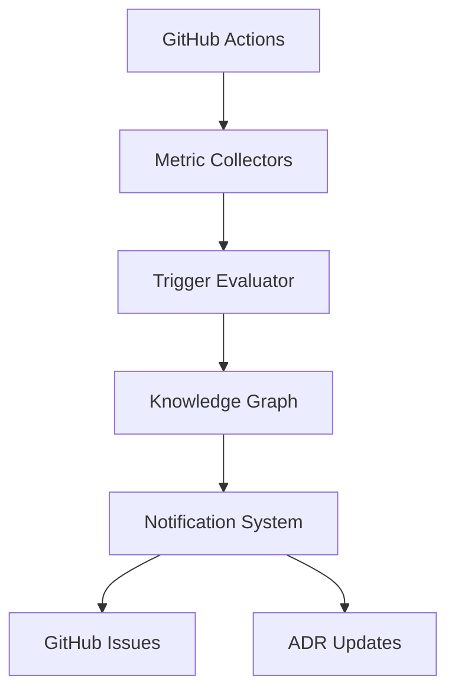

# ADR 0001: Preference Monitoring System with Knowledge Graph Integration

## Status

Proposed

## Context

We need a system to monitor and trigger re-evaluation of user preferences stored in the Knowledge Graph. This system should help maintain the relevance and effectiveness of development preferences over time.

## Decision

Implement a preference monitoring system that:

1. Integrates with the Knowledge Graph for preference storage and retrieval
2. Uses automated metrics collection through GitHub Actions
3. Implements configurable triggers for preference re-evaluation
4. Provides notification and documentation mechanisms

## Technical Details

### Knowledge Graph Integration

```typescript
interface PreferenceNode {
  type: 'preference';
  category: PreferenceCategory;
  observations: string[];
  lastEvaluated: Date;
  triggers: TriggerDefinition[];
}

interface TriggerNode {
  type: 'trigger';
  category: TriggerCategory;
  metrics: MetricDefinition[];
  thresholds: ThresholdConfig;
}
```

### Monitoring System Architecture



## Consequences

### Positive

- Automated preference maintenance
- Data-driven decision making
- Clear documentation trail
- Integration with existing tools

### Negative

- Additional system complexity
- Potential for false positives
- Maintenance overhead

### Neutral

- Requires regular review of trigger configurations
- May need adjustment of thresholds over time

## Implementation Notes

- System will be implemented as a separate package
- All preferences and triggers stored in Knowledge Graph
- Accessible to AI agents through MCP Memory tools
- Configurable through TypeScript configuration files
