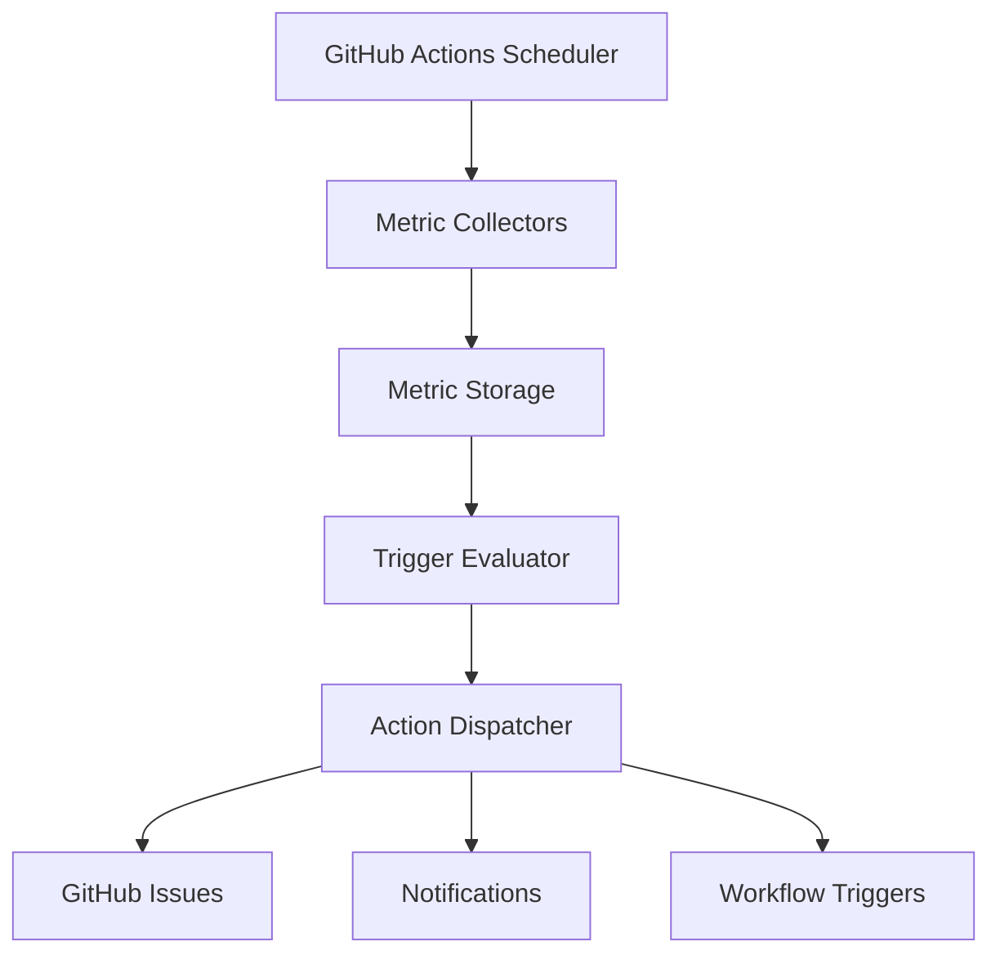

# ADR 0002: Repository Metrics and Trigger System

## Status

Proposed

## Context

We need a system to collect, analyze, and act upon various repository metrics to maintain code quality, performance, and security. This system should provide automated monitoring and trigger appropriate actions based on configurable thresholds.

## Decision

Implement a repository metrics and trigger system that:

1. Collects metrics through GitHub Actions workflows
2. Evaluates metrics against configurable thresholds
3. Triggers appropriate actions based on evaluation results
4. Maintains historical metric data for trend analysis

## Technical Details

### Metric Categories

```typescript
interface ThresholdConfig {
  warning: number;
  critical: number;
  trend?: {
    period: string;
    threshold: number;
  };
}

type MetricCategory =
  | 'code-quality'
  | 'test-coverage'
  | 'build-performance'
  | 'dependency-health'
  | 'security';

interface MetricDefinition {
  category: MetricCategory;
  collector: MetricCollector;
  schedule: CollectionSchedule;
  thresholds: ThresholdConfig;
}
```

### Trigger System

```typescript
interface TriggerCondition {
  type: 'threshold' | 'trend' | 'combination';
  evaluation: string; // JavaScript expression
  period?: string;
}

interface TriggerAction {
  type: 'issue' | 'notification' | 'workflow';
  config: Record<string, unknown>;
}

interface TriggerDefinition {
  name: string;
  description: string;
  metrics: MetricDefinition[];
  conditions: TriggerCondition[];
  actions: TriggerAction[];
}
```

### System Architecture



## Consequences

### Positive

- Automated metric collection and analysis
- Early detection of quality issues
- Historical trend analysis
- Configurable response actions

### Negative

- Additional CI/CD overhead
- Potential for false positives
- Storage requirements for historical data

### Neutral

- Requires regular threshold calibration
- May need periodic rule refinement

## Implementation Notes

- System will run entirely within GitHub Actions
- Metrics stored in repository as JSON files
- Actions configurable through TypeScript/JSON
- Historical data retained for trend analysis
- Integration with existing notification systems

## Related ADRs

- [ADR 0001: Preference Monitoring System](./0001-preference-monitoring-system.md) - Separate system for preference management in Knowledge Graph
