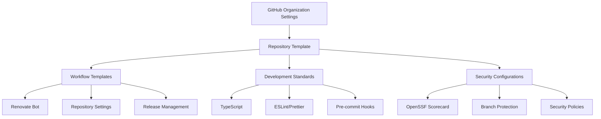
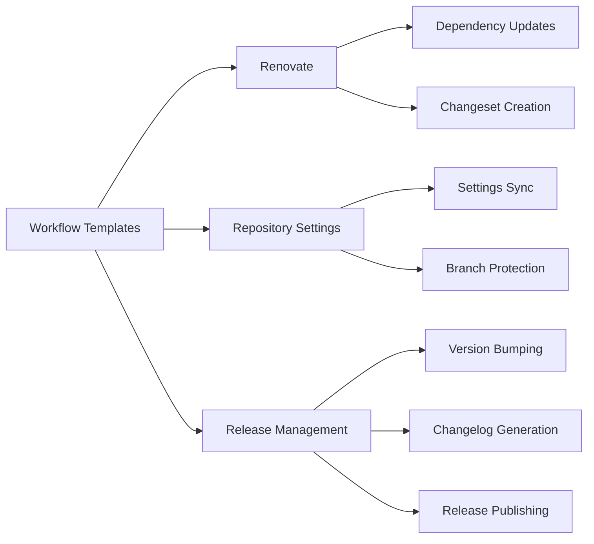
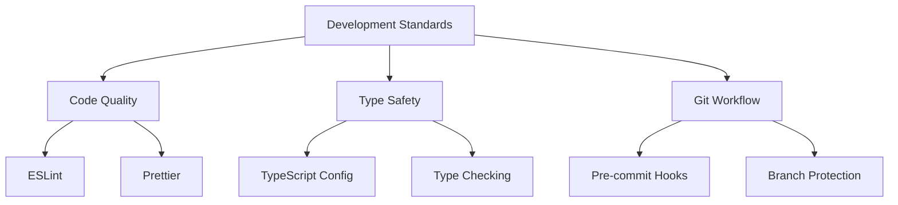
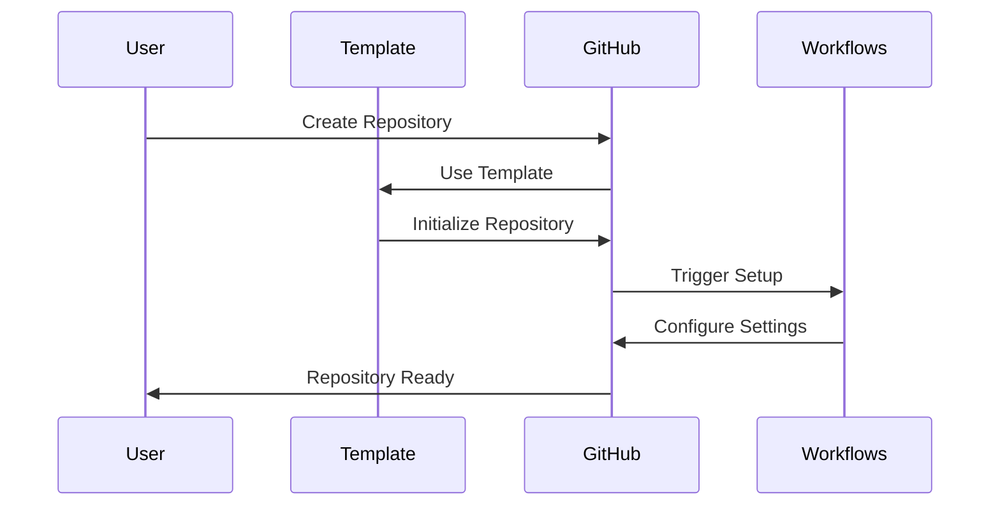
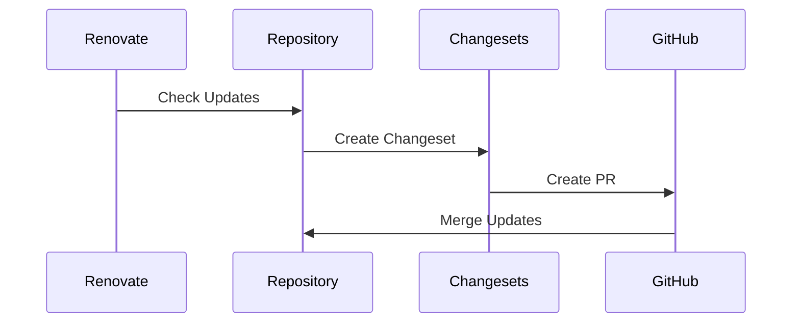

# Architecture Documentation

## System Overview

### High-Level Architecture

## Component Architecture

### 1. Repository Template System
- Base configuration files
- Community health files
- Development tooling setup
- Documentation templates

### 2. Workflow System

### 3. Development Standards System

## Core Components

### 1. Settings Management
- Location: `.github/settings.yml`
- Purpose: Define repository settings
- Integration: GitHub API via actions-settings

### 2. Workflow Templates
- Location: `workflow-templates/`
- Purpose: Reusable GitHub Actions
- Components:
  - Renovate automation
  - Settings management
  - Release process

### 3. Development Tools
- Location: Root directory
- Purpose: Development environment setup
- Components:
  - TypeScript configuration
  - ESLint/Prettier setup
  - Husky hooks
  - pnpm scripts

### 4. Security Framework
- Location: Various configuration files
- Purpose: Security enforcement
- Components:
  - OpenSSF integration
  - Branch protection
  - Access control
  - Security policies

## Data Flow

### 1. Repository Creation Flow

### 2. Update Flow

## Integration Points

### 1. GitHub Integration
- GitHub API for settings
- Actions for automation
- Branch protection API
- Repository template system

### 2. Development Integration
- pnpm for package management
- TypeScript compilation
- ESLint/Prettier integration
- Husky git hooks

### 3. Security Integration
- OpenSSF Scorecard API
- GitHub security features
- Automated security updates
- Access control system

## Deployment Architecture

### 1. Template Deployment
- Initial repository setup
- Configuration file copying
- Workflow installation
- Documentation setup

### 2. Updates Deployment
- Automated dependency updates
- Settings synchronization
- Security patches
- Documentation updates

## System Requirements

### 1. Performance Requirements
- Fast workflow execution
- Efficient dependency management
- Quick template instantiation
- Responsive automation

### 2. Security Requirements
- Secure configuration storage
- Protected branch enforcement
- Access control management
- Security policy compliance

### 3. Scalability Requirements
- Multiple repository support
- Concurrent workflow execution
- Organization-wide settings
- Template reusability

## Monitoring and Maintenance

### 1. Health Checks
- Workflow execution status
- Security score monitoring
- Dependency update status
- Settings synchronization

### 2. Maintenance Tasks
- Regular dependency updates
- Security patch application
- Configuration updates
- Documentation updates
