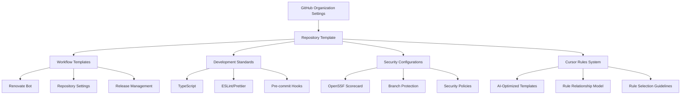
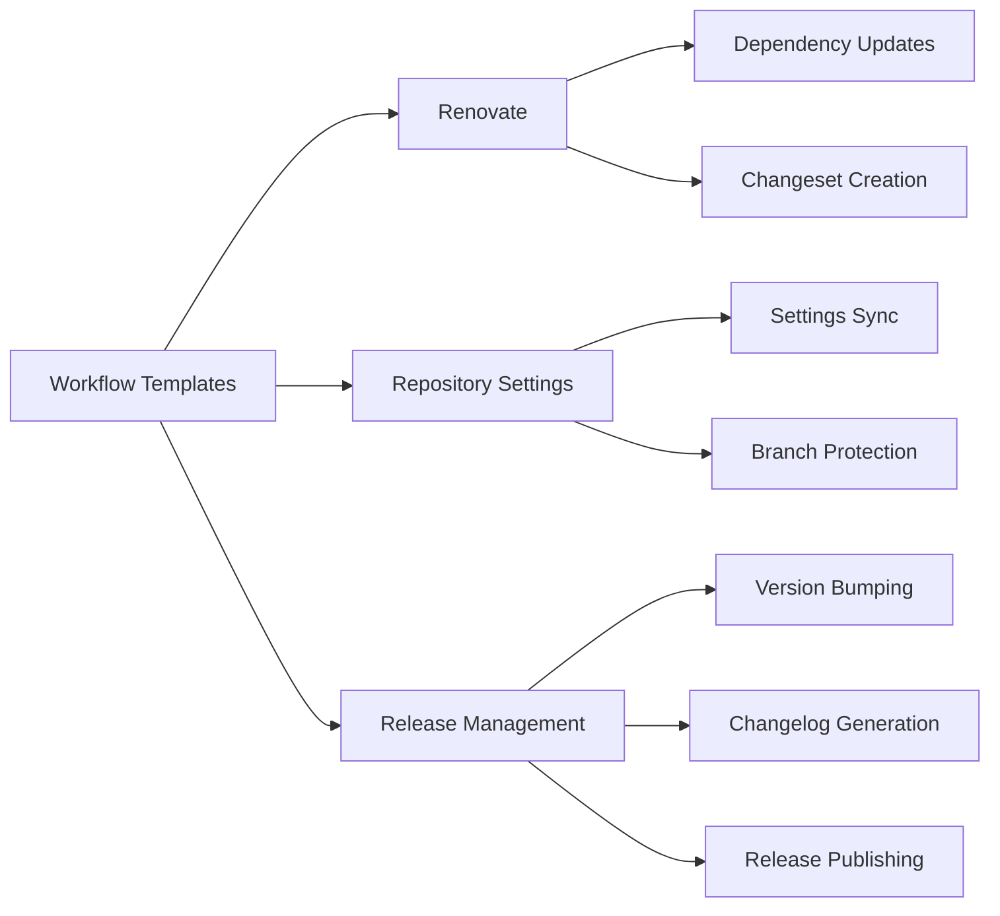
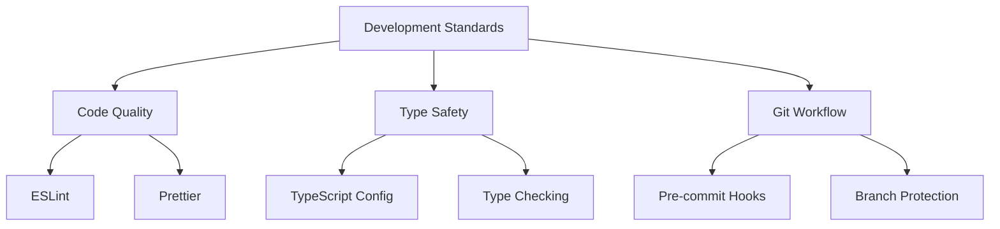
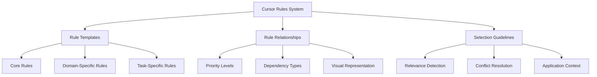
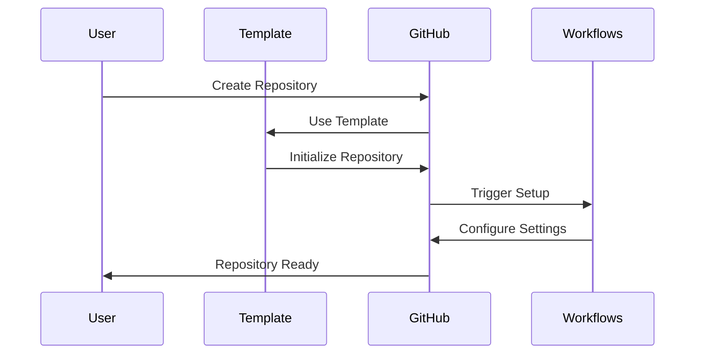
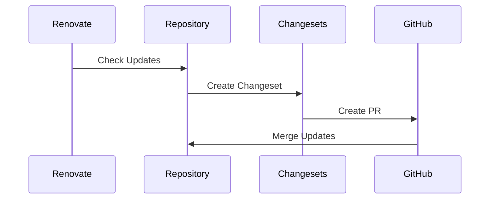
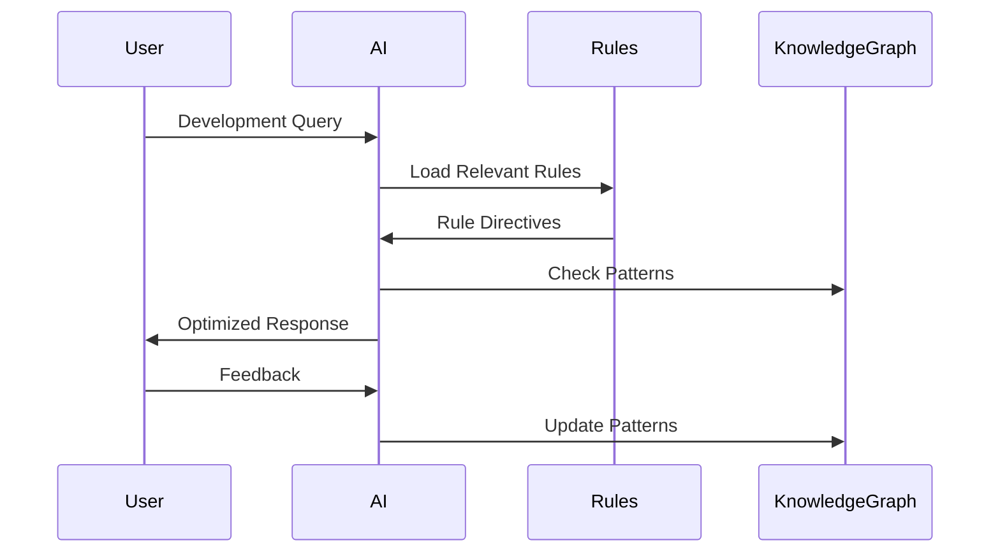

# Architecture Documentation

## System Overview

### High-Level Architecture

## Component Architecture

### 1. Repository Template System

- Base configuration files
- Community health files
- Development tooling setup
- Documentation templates

### 2. Workflow System

### 3. Development Standards System

### 4. Cursor Rules System

- **Purpose**: Provide AI-optimized guidance for project development
- **Location**: `.cursor/rules/*.mdc` files
- **Core Components**:
  - Rule templates with standardized structure and directive markers
  - Rule relationship model with priority and dependency indicators
  - Selection guidelines for AI consumption
- **Integration Points**:
  - Development standards enforcement
  - Knowledge graph for pattern tracking
  - Memory files for documentation

## Core Components

### 1. Settings Management

- Location: `.github/settings.yml`
- Purpose: Define repository settings
- Integration: GitHub API via actions-settings

### 2. Workflow Templates

- Location: `workflow-templates/`
- Purpose: Reusable GitHub Actions
- Components:
  - Renovate automation
  - Settings management
  - Release process

### 3. Development Tools

- Location: Root directory
- Purpose: Development environment setup
- Components:
  - TypeScript configuration
  - ESLint/Prettier setup
  - Husky hooks
  - pnpm scripts

### 4. Security Framework

- Location: Various configuration files
- Purpose: Security enforcement
- Components:
  - OpenSSF integration
  - Branch protection
  - Access control
  - Security policies

### 5. Cursor Rules Framework

- Location: `.cursor/rules/`
- Purpose: AI-optimized development guidance
- Components:
  - `rules.mdc`: Central index with relationship diagram
  - `cursor-rules.mdc`: Template definitions and formatting guidelines
  - `rule-preprocessing.mdc`: Rule selection and application guidance
  - Various domain-specific and task-specific rules

## Data Flow

### 1. Repository Creation Flow

### 2. Update Flow

### 3. Cursor Rules Consumption Flow

## Integration Points

### 1. GitHub Integration

- GitHub API for settings
- Actions for automation
- Branch protection API
- Repository template system

### 2. Development Integration

- pnpm for package management
- TypeScript compilation
- ESLint/Prettier integration
- Husky git hooks

### 3. Security Integration

- OpenSSF Scorecard API
- GitHub security features
- Automated security updates
- Access control system

### 4. AI Integration

- Cursor rules for AI consumption
- Knowledge graph for pattern tracking
- Standardized rule format
- Priority-based rule selection

## Deployment Architecture

### 1. Template Deployment

- Initial repository setup
- Configuration file copying
- Workflow installation
- Documentation setup

### 2. Updates Deployment

- Automated dependency updates
- Settings synchronization
- Security patches
- Documentation updates

### 3. Rules Deployment

- Rule templates in `.cursor/rules/`
- Standardized frontmatter with priority and scope
- Visual relationship diagram
- AI directive markers

## System Requirements

### 1. Performance Requirements

- Fast workflow execution
- Efficient dependency management
- Quick template instantiation
- Responsive automation
- Optimized rule parsing by AI

### 2. Security Requirements

- Secure configuration storage
- Protected branch enforcement
- Access control management
- Security policy compliance

### 3. Scalability Requirements

- Multiple repository support
- Concurrent workflow execution
- Organization-wide settings
- Template reusability
- Extensible rule framework

## Monitoring and Maintenance

### 1. Health Checks

- Workflow execution status
- Security score monitoring
- Dependency update status
- Settings synchronization
- Rule effectiveness metrics

### 2. Maintenance Tasks

- Regular dependency updates
- Security patch application
- Configuration updates
- Documentation updates
- Rule pattern updates

## Related Files

- **Dependencies:**

  - [technical.md](/docs/technical.md): Detailed technical specifications
  - [product_requirement_docs.md](/docs/product_requirement_docs.md): High-level requirements
  - [tasks_plan.md](/tasks/tasks_plan.md): Implementation schedule

- **Extensions:**
  - [active_context.md](/tasks/active_context.md): Current development focus
  - [cursor-rules-enhancement.md](/tasks/cursor-rules-enhancement.md): Rules enhancement plan
