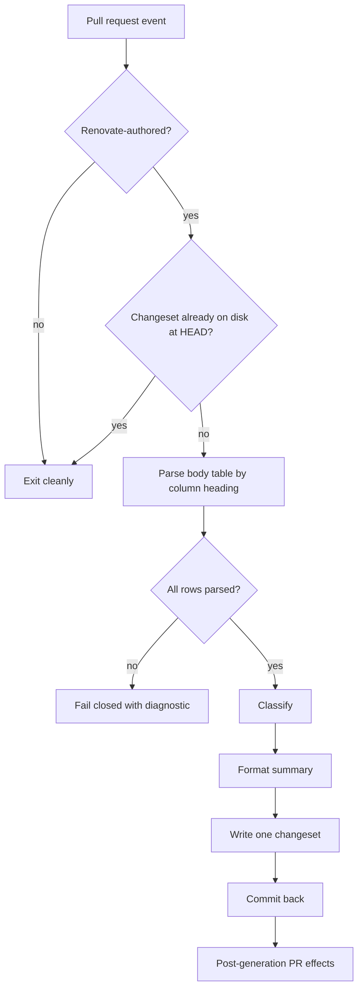

# refactor: Simplify renovate-changesets around the Renovate PR body

## Overview

The `renovate-changesets` action spends 15,061 lines across 125 files to write a two-line changeset file. Most of that volume re-derives facts Renovate already publishes: seven ecosystems of detectors read lockfiles, Dockerfiles, and workflow YAML to determine what changed, while the pull request body states it directly.

This plan removes that duplication in two phases. Phase 1 deletes three ecosystems that have never fired, repairs two inputs that never worked, and drops unused dependencies. Phase 2 rebuilds the pipeline around the pull request body, supplemented by branch and commit metadata for the facts the body does not reliably carry.

## Problem Frame

Three of seven ecosystems — Go, JVM, and Python — carry 2,001 lines and have never processed a real update. No consumer repository contains those dependencies.

Two documented inputs do nothing. `auto-resolve-conflicts` and `skip-current-pr-in-group` are read with a boolean coercion that discards the configured value, so both are permanently enabled.

Coverage sits at 62.52% statements and 56.89% branches against thresholds of 80% and 75%, and has appeared in every daily report for nine consecutive runs.

Security classification claims more precision than it has. Severity comes from substring-matching words like "critical" in body text, and CVE identifiers are matched against package names and version strings rather than an advisory source. Severity is then assigned arithmetically from the CVE sequence number.

See origin: `docs/brainstorms/renovate-changesets-simplification-requirements.md`.

## Requirements Trace

**Phase 1**

- R1. Remove the Go, JVM, and Python detection paths and their tests.
- R2. Repair the boolean coercion so `auto-resolve-conflicts` and `skip-current-pr-in-group` honour their configured values.
- R3. Remove package dependencies that no source file imports.
- R4. Land Phase 1 independently. Changeset output for live ecosystems is unchanged; the two repaired inputs are a deliberate behaviour change for any consumer that set them to false.
- R4a. Announce removal of the Go, JVM, and Python paths in the release notes, and state that they can be restored if a consumer needs them.
- R4b. Enumerate org-wide consumers of the action and the reusable workflow before deleting any ecosystem, and confirm none depends on the removed paths.

**Phase 2**

- R5. Derive package names, version transitions, manager type, and grouping from the Renovate pull request body.
- R6. Support npm, Docker, GitHub Actions, and security updates.
- R7. Reduce the pipeline to parse, classify, format, and write.
- R8. Consolidate changeset writing into a single path.
- R9. Determine the semver bump from the parsed version transition, taking the highest applicable bump for grouped updates.
- R10. Fail with a diagnostic naming the pull request number and the unparseable field, without echoing body content, token values, or environment material.
- R10a. Confirm Renovate authorship from the author login, not merely a bot-suffixed actor or a branch prefix, before parsing the body as authoritative.
- R10c. Normalise every body-derived value before formatting or writing it, rejecting or escaping markdown control characters, newlines, and path separators.
- R10b. Handle `merge_group` events without a reachable pull request body.
- R11. Accept an `emoji` input, defaulting to disabled.
- R11a. Call out the emoji default change in the release notes.
- R12. Keep `action.yaml` additive.
- R13. Restore coverage to 80% statements, functions, and lines, and 75% branches, measured package-wide as the existing configuration does.
- R13a. Bring the retained commit-back and grouped-PR machinery under characterisation coverage, since package-wide thresholds cannot be met while it sits near zero.
- R14. Assert observable behaviour rather than internal module shapes.

## Scope Boundaries

- Replacing the action with a Renovate `postUpgradeTasks` script.
- Removing or repurposing any existing `action.yaml` input or output.
- Adding ecosystems beyond npm, Docker, GitHub Actions, and security.
- Changing how consumers invoke the action or the reusable workflow.
- Simplifying the commit-back retry and conflict machinery.
- Changing Renovate presets in `bfra-me/renovate-config` or `marcusrbrown/renovate-config`.

### Deferred to Separate Tasks

- Reconciling `.github/instructions/changesets.instructions.md`, which still instructs contributors to run the banned `pnpm changeset` CLI. It contradicts root `AGENTS.md`, is a repo-wide documentation problem rather than an action problem, and gates neither release. Documentation owned by this plan is limited to the action's own `README.md` and `AGENTS.md`, plus the file-count line in root `AGENTS.md`.

## Success Criteria

- Every module in the current detection and generation stack is gone, except the deliberately retained commit-back machinery, grouped-PR manager, and the compatibility adapter. Retention is by explicit decision, not by omission.
- The action produces correct changesets for npm, Docker, GitHub Actions, grouped, and security updates in both `bfra-me/works` and `marcusrbrown/infra`, with no workflow changes in either.
- Package-wide coverage meets the configured thresholds, and the daily report stops flagging the gap.
- Every `action.yaml` input and output present before the work is still declared and populated after it, enforced by a guard test rather than review.
- An operator hitting a parse failure can tell from the diagnostic alone which pull request and which row caused it, and what to do next.

## Context & Research

### Relevant Code and Patterns

- Current spine: `src/index.ts` → `src/run.ts` → `src/run-init.ts` → `src/run-analysis.ts` → `src/run-generation.ts` → writer.
- Two writers exist: `src/changeset-writer.ts` and `src/multi-package-gen/changeset-writer.ts`.
- `src/detector-runner.ts` statically imports every ecosystem detector and registers them in a config array — deleting detector files without editing it breaks compilation.
- `src/action-config.ts` hardcodes Go, JVM, and Python update types in `DEFAULT_CONFIG`.
- `src/parser/` already extracts version transitions from body text and strips release notes.
- `src/changeset-info-formatter.ts` consumes `CategorizationInfo` and `MultiPackageInfo`, which the post-generation PR features depend on.
- `src/run.ts` exits early when the changed-file list already contains a `.changeset/` entry.
- Structural target: `.github/actions/update-repository-settings/` — 13 source files, a plugin registry, and tests colocated under `src/__tests__/`.
- Test harness: `test/setup.ts` provides `createMockPRContext`, `createMockDependency`, `createMockPRFile`, and `createMockCommit`, plus shared mock instances. Reusable by the rewrite.
- Build: `tsup.config.ts` bundles dependencies via `noExternal`, targets `node24`, emits ESM to `dist/`.

### Institutional Learnings

- `docs/solutions/process/renovate-changesets-fix-workflow.md` defines the mandatory shipping sequence: branch as `fix/renovate-changesets-<description>`, verify with type-check then the package test project then fix then lint, run `pnpm build`, write a manual changeset scoped to `renovate-changesets`, and commit `dist/index.js` alongside source. Release then flows through a changesets release PR, a version tag, and a Renovate bump of the pinned reference.
- `docs/solutions/integration-issues/shallow-checkout-breaks-paths-filter-on-push-events-2026-06-25.md` establishes that checkout depth is part of the workflow contract, not an implementation detail.

### External References

- Renovate exposes no structured metadata block in pull request bodies. The markdown table is the only surface, and `prBodyTemplate`, `prBodyColumns`, `prBodyDefinitions`, and `prBodyHeadingDefinitions` all let a repository reshape it.
- The `renovatebot.com/diffs/<manager>/...` URL format is not a documented contract and cannot be relied on for manager identity.
- `groupName` is a branch and configuration concept; it is not guaranteed to appear in the body.
- Security updates carry non-body signals: the default branch topic includes `vulnerability`, the default commit message suffix is `[SECURITY]`, and `vulnerabilityAlerts` can attach labels.
- No consumer currently configures any `prBody*` option, so all consumers are on Renovate defaults today.

## Key Technical Decisions

- **Parse the body table by column heading, not column position.** Headings are the only semi-stable anchor; positional parsing breaks the moment a consumer adds a column.
- **Take manager type, grouping, and security provenance from branch and commit metadata, not body prose.** Renovate guarantees none of the three in the body, and all three have reliable non-body signals.
- **Replace substring severity matching with Renovate's own security markers.** The existing classifier invents precision; branch topic and commit suffix are authoritative by comparison.
- **Preserve the commit-back retry and conflict machinery unchanged.** It absorbs the force-push and rebase races that Renovate produces routinely, and rewriting it trades a code-size win for pipeline flakiness.
- **Keep post-generation PR features working through a compatibility adapter.** The interface is additive-only, so PR commenting and description updates must survive; the adapter maps parsed results into the structures the formatter already expects.
- **Fail closed on any row-level parse failure.** A partial changeset produces an incomplete release, which is worse than a blocked pull request.
- **Check for an existing changeset against files on disk at HEAD.** Renovate force-pushes erase prior commits, so a stale file list would skip generation for a changeset that no longer exists.
- **Delete superseded modules only after the new path passes its tests.** Deletion is the irreversible step and belongs last.

## Open Questions

### Resolved During Planning

- Does the rewrite lose security metadata by deleting advisory parsing? No. The current parsers read only package names and version strings; there is no advisory lookup to lose.
- Is the pull request body reachable for every trigger? Not for `merge_group`, which is declared but has never fired. Handled explicitly rather than assumed away.
- Should the Renovate presets pin the body shape? No. Both presets are controlled but separate, and coordinating them adds a version-skew window for a risk that non-body signals already mitigate.
- Does this action need a SHA pin update on release? Not from this repository's release script — `renovate-changesets` has no `WORKFLOW_PIN_MAPPINGS` entry. Direct downstream pinners update through their own Renovate runs.

### Deferred to Implementation

- How prerelease and non-semver version strings map to a bump level.
- Which body table headings to treat as required versus optional across Renovate versions.
- Whether the existing integration suites can be adapted or need rewriting against the new pipeline.
- Whether `merge_group` is removed from the reusable workflow or handled as a clean skip.

## High-Level Technical Design

> *This illustrates the intended approach and is directional guidance for review, not implementation specification. The implementing agent should treat it as context, not code to reproduce.*

Signal sourcing splits by reliability:

| Fact | Source | Why |
|---|---|---|
| Package name, version transition | Body table | Published directly, keyed by column heading |
| Renovate authorship | Actor and branch prefix | Body is attacker-influencable text |
| Manager type | Branch name | Diff URL format is undocumented |
| Grouping | Branch naming | `groupName` absent from body |
| Security | Branch topic, `[SECURITY]` commit suffix, labels | Body severity words are not a contract |

## Implementation Units

### Phase 1 — Prune and repair

- [ ] **Unit 1: Remove the Go, JVM, and Python detection paths**

**Goal:** Delete three ecosystems that have never processed an update, including every registration point.

**Requirements:** R1, R4, R4b

**Dependencies:** None

**Files:**
- Delete: `src/go-change-detector.ts`, `src/jvm-change-detector.ts`, `src/python-change-detector.ts`
- Delete: `src/detectors/go-*.ts`, `src/detectors/jvm-*.ts`, `src/detectors/python-*.ts`
- Modify: `src/detector-runner.ts`, `src/action-config.ts`
- Modify: `README.md`, `AGENTS.md`
- Test: `test/integration/end-to-end.test.ts`, delete `test/go-change-detector.test.ts`, `test/jvm-change-detector.test.ts`, `test/python-change-detector.test.ts`

**Approach:**
- Before deleting anything, search the organisation for repositories referencing the action or the reusable workflow. The evidence that these ecosystems never fire comes from two known consumers, but the workflow template publishes the action org-wide.
- `src/detector-runner.ts` statically imports the deleted detectors and lists them in its registry; both must be updated or compilation fails.
- `DEFAULT_CONFIG` in `src/action-config.ts` enumerates update types for the removed ecosystems.
- The end-to-end integration suite registers mocks for all three detectors.

**Patterns to follow:**
- Detector registration shape already in `src/detector-runner.ts` for the retained ecosystems.

**Test scenarios:**
- Happy path: an npm update still produces the same changeset content as before the deletion.
- Happy path: a Docker update still produces the same changeset content as before the deletion.
- Happy path: a GitHub Actions update still produces the same changeset content as before the deletion.
- Edge case: a pull request touching a `go.mod` file produces no changeset and exits cleanly rather than erroring.

**Verification:**
- Type-check, lint, and the package test project all pass.
- No reference to the removed ecosystems remains in source, tests, or documentation.

- [ ] **Unit 2: Repair boolean input handling**

**Goal:** Make `auto-resolve-conflicts` and `skip-current-pr-in-group` honour configured values.

**Requirements:** R2

**Dependencies:** None

**Files:**
- Modify: `src/git-operations.ts`, `src/grouped-pr-manager.ts`
- Test: `test/action-config.test.ts`

**Approach:**
- Both sites coerce a boolean input with a fallback that discards a `false` value, leaving the input permanently enabled.
- Audit remaining boolean input handling in `src/action-config.ts` for the same pattern rather than fixing only the two known sites.

**Test scenarios:**
- Happy path: with `auto-resolve-conflicts` unset, the default applies.
- Edge case: with `auto-resolve-conflicts` set to false, conflict resolution is not attempted.
- Edge case: with `skip-current-pr-in-group` set to false, the current pull request is included in group processing.

**Verification:**
- Each repaired input demonstrably changes behaviour when toggled.

- [ ] **Unit 3: Remove unused dependencies and ship Phase 1**

**Goal:** Drop dependencies no source file imports, then release Phase 1.

**Requirements:** R3, R4, R4a

**Dependencies:** Unit 1, Unit 2

**Files:**
- Modify: `package.json`
- Create: a changeset scoped to `renovate-changesets`
- Modify: `dist/index.js`

**Approach:**
- `@actions/github` and `@changesets/parse` have no `src/` imports. Confirm after Unit 1's deletions, since removed files may have been the only consumers of others.
- Follow the shipping sequence in `docs/solutions/process/renovate-changesets-fix-workflow.md`: verify, build, changeset, commit `dist/index.js` with source.
- The changeset text carries the R4a deprecation announcement.

**Test scenarios:**
- Happy path: the built bundle loads and runs against a fixture pull request after dependency removal.

**Verification:**
- The full verification sequence from the process document passes.
- The release notes state which ecosystems were removed and that they can be restored on request.

### Phase 2 — Rewrite around the pull request body

- [ ] **Unit 4: Extraction layer**

**Goal:** Produce a typed update list from the pull request body and non-body metadata.

**Requirements:** R5, R10, R10a, R10b

**Dependencies:** Unit 3

**Files:**
- Create: `src/extract/` for body-table and metadata extraction
- Modify: `src/run-init.ts`
- Test: `test/extract/`

**Approach:**
- Resolve columns by heading text, so an added or reordered column does not break extraction.
- Confirm Renovate authorship from the author login. A bot-suffixed actor and a `renovate/` branch prefix are both reachable by other bots in the organisation, so neither is sufficient alone.
- Detect `merge_group` and exit cleanly rather than attempting body access.
- Any row that fails to parse fails the whole run. The diagnostic names the offending row so an operator can either correct the pull request body and re-run, or split the group, without reading logs to find the cause.
- Treat every extracted value as untrusted text: normalise it at the extraction boundary rather than at the point of writing.

**Execution note:** Implement test-first — the parsing contract is the highest-risk surface in the rewrite and the fixtures define it.

**Patterns to follow:**
- Version-arrow matching and release-note stripping already in `src/parser/renovate-dependency-extractor.ts`.
- Fixture builders in `test/setup.ts`.

**Test scenarios:**
- Happy path: a default single-update body yields one update with package, both versions, and manager.
- Happy path: a body with an extra custom column still parses via heading lookup.
- Edge case: a body whose columns are reordered still parses correctly.
- Edge case: a grouped body yields one update per row.
- Error path: a body with one malformed row fails closed and writes nothing.
- Error path: a body with no recognisable table fails with a diagnostic naming the pull request number.
- Error path: the diagnostic contains no body text, token value, or environment variable.
- Edge case: a pull request from a non-Renovate author exits cleanly without parsing.
- Edge case: a `merge_group` event exits cleanly with a log line and no changeset.

**Verification:**
- Extraction is proven against fixtures for every supported ecosystem and for grouped and security shapes.

- [ ] **Unit 5: Classification**

**Goal:** Turn extracted updates into a bump level and update category.

**Requirements:** R6, R9

**Dependencies:** Unit 4

**Files:**
- Create: `src/classify/`
- Test: `test/classify/`

**Approach:**
- Derive the bump from the version transition; grouped updates take the highest applicable bump.
- Identify security updates from branch topic, commit message suffix, and labels rather than body severity words.

**Test scenarios:**
- Happy path: a patch transition yields a patch bump.
- Happy path: a major transition yields a major bump.
- Edge case: a group containing patch and minor transitions yields minor.
- Edge case: a group containing minor and major transitions yields major.
- Edge case: a non-semver version string is handled without throwing.
- Happy path: a branch topic containing `vulnerability` classifies as a security update.
- Happy path: a commit message carrying the `[SECURITY]` suffix classifies as a security update.
- Edge case: a body mentioning the word "critical" in a changelog excerpt does not classify a routine update as security.

**Verification:**
- Bump selection and security classification are both proven independently of body prose.

- [ ] **Unit 6: Formatting and the emoji input**

**Goal:** Produce changeset summary text, with emoji controlled by a new input.

**Requirements:** R11, R12

**Dependencies:** Unit 5

**Files:**
- Create: `src/format/`
- Modify: `action.yaml`, `src/action-config.ts`
- Test: `test/format/`

**Approach:**
- Add `emoji` as a new input defaulting to disabled; add nothing else and remove nothing.
- Formatting is a pure function of the classified update, so it tests without mocks.

**Test scenarios:**
- Happy path: with emoji disabled, a Docker update summary begins with the update verb and carries no emoji.
- Happy path: with emoji enabled, the same update carries its ecosystem emoji.
- Happy path: a grouped update summary names every package in the group.
- Edge case: a package name containing markdown characters is rendered without breaking the changeset.

**Verification:**
- Output is byte-identical for a given input and emoji setting.

- [ ] **Unit 7: Single writer and compatibility adapter**

**Goal:** Write changesets through one path, and keep post-generation PR features working.

**Requirements:** R7, R8, R12

**Dependencies:** Unit 6

**Files:**
- Modify: `src/run-generation.ts`, `src/changeset-writer.ts`, `src/changeset-summary-generator.ts`, `src/multi-package-changeset-generator.ts`
- Create: adapter mapping classified results to the structures `src/changeset-info-formatter.ts` expects
- Test: `test/changeset-writer.test.ts`

**Approach:**
- Collapse the two writers into one, retaining the multi-package behaviour the surviving path needs.
- Sever the imports that would otherwise block Unit 8: `src/changeset-summary-generator.ts` pulls from both the template engine and `src/summaries/`, `src/run-generation.ts` pulls from the template engine, and `src/multi-package-changeset-generator.ts` pulls from the multi-package writer. Each must be rewritten onto the new formatter or deleted here, before Unit 8 removes their dependencies.
- The adapter populates the category and multi-package structures the PR comment and description features already consume, so those features keep working without their original computation stack.
- Record which adapter fields remain exact and which become derived. Package names, versions, and bump level stay exact; risk scores and confidence values become fixed derivations of the bump level rather than computed analysis. State this in the release notes so the reduced fidelity is visible rather than silently swapped in.
- Check for an existing changeset against files on disk at HEAD, since force-pushes erase earlier commits.

**Patterns to follow:**
- The existing early-exit guard in `src/run.ts`.

**Test scenarios:**
- Happy path: a single update writes exactly one changeset file with correct frontmatter.
- Happy path: a grouped update writes exactly one changeset naming all packages.
- Edge case: a changeset already present on disk causes a clean skip with no second file.
- Edge case: a package name containing markdown control characters is escaped and does not corrupt the changeset file.
- Integration: with `comment-pr` enabled, a comment is posted containing the generated summary.
- Integration: with `update-pr-description` enabled, the description is updated.

**Verification:**
- Every `action.yaml` output is still populated.
- Post-generation features behave as before the rewrite, with adapter-derived fields documented as derived.
- Type-check passes with the new pipeline wired in and the old modules still present, proving Unit 8's deletions are safe to make.

- [ ] **Unit 8: Delete superseded modules**

**Goal:** Remove the detection and generation strata the new pipeline replaces.

**Requirements:** R7

**Dependencies:** Unit 7

**Files:**
- Delete: `src/detectors/`, `src/detector-runner.ts`, `src/summaries/`, `src/changeset-template-engine.ts`, `src/multi-package-gen/changeset-writer.ts`
- Modify: `src/run-analysis.ts`

**Dependencies:** Unit 7 must have severed the imports from `src/changeset-summary-generator.ts`, `src/run-generation.ts`, and `src/multi-package-changeset-generator.ts` first.

**Approach:**
- Deletion is the irreversible step and runs only after Unit 7 proves the replacement.
- Retain `src/git-operations.ts` and `src/grouped-pr-manager.ts` unchanged. Neither imports from the deleted paths, so the retention claim holds.
- Work through the module graph rather than by directory, since surviving code may import individual helpers.

**Test scenarios:**
- Happy path: the full pipeline produces identical changesets before and after deletion for each supported ecosystem.

**Verification:**
- Type-check passes with no unresolved imports.
- The retained commit-back machinery is untouched.

- [ ] **Unit 9: Test migration, coverage, and ship Phase 2**

**Goal:** Restore coverage against observable behaviour and release the rewrite.

**Requirements:** R10c, R11a, R13, R13a, R14

**Dependencies:** Unit 8

**Files:**
- Modify: `test/integration/end-to-end.test.ts`, `test/integration/components.test.ts`, `test/index.test.ts`
- Delete: tests targeting removed internals
- Create: a changeset scoped to `renovate-changesets`
- Modify: `dist/index.js`

**Approach:**
- Existing suites mock internal detector modules directly and cannot survive the rewrite unchanged.
- Assert on the written changeset file for a given pull request fixture rather than on intermediate module calls.
- Add a guard test asserting every baseline `action.yaml` input and output is still declared, enforcing the additive rule mechanically.
- Bring the retained machinery under characterisation coverage. It currently sits at 4.1% and 5.5% of statements; package-wide thresholds are unreachable while it stays there, regardless of how well the new pipeline is tested.
- The changeset text carries the R11a emoji announcement and the adapter fidelity note from Unit 7.

**Execution note:** Add the `action.yaml` guard test before deleting old suites, so interface drift cannot slip through the migration window.

**Test scenarios:**
- Happy path: an end-to-end fixture for each supported ecosystem writes the expected changeset.
- Integration: the `action.yaml` guard test fails when any baseline input or output is removed.
- Integration: a commit-back run against a fixture repository commits the changeset and reports success.
- Error path: a push rejected as non-fast-forward is retried according to the configured retry count.
- Error path: diagnostics emitted on parse failure contain no body text, no token value, and no environment variable name.
- Edge case: package-wide coverage thresholds are met.

**Verification:**
- Coverage reports at or above 80% statements, functions, and lines, and 75% branches.
- The full process-document verification sequence passes.
- Release notes state the emoji default change and name the input that restores previous output.

## System-Wide Impact

- **Interaction graph:** The reusable workflow at `.github/workflows/renovate-changeset.yaml` invokes the action for `bfra-me/works`; `marcusrbrown/infra` invokes it directly. The workflow template at `workflow-templates/renovate-changesets.yaml` publishes it org-wide, so unknown consumers may exist.
- **Error propagation:** Parse failures fail the run and block the affected pull request. They do not block other pull requests or the release pipeline.
- **State lifecycle risks:** Renovate force-pushes erase committed changesets; the existing-changeset check must read disk at HEAD. Concurrent runs on the same branch race on push, which the retained commit-back machinery already handles.
- **API surface parity:** `action.yaml` inputs and outputs stay declared and populated across both phases.
- **Integration coverage:** The commit-back path, PR commenting, and description updating cross layers that unit tests with mocks will not prove.
- **Unchanged invariants:** The commit-back retry and conflict machinery, the grouped-PR manager, every existing input and output, and the way consumers invoke the action all stay as they are.

## Risks & Dependencies

| Risk | Mitigation |
|------|------------|
| A consumer reshapes the body via `prBodyTemplate` or `prBodyColumns` | Parse by column heading; fail closed with a diagnostic rather than writing a wrong changeset |
| An unknown org consumer depends on a removed ecosystem | Announce removal in the Phase 1 release notes with a stated restoration path |
| Renovate changes its default body format | Non-body signals cover manager, grouping, and security; only package and version depend on the table |
| Deleting modules breaks a surviving import | Deletion happens after the replacement passes tests, and follows the module graph rather than directories |
| Test migration hides a behaviour regression | The `action.yaml` guard test lands before old suites are deleted |
| Two releases mean two consumer-visible transitions | Phase 1 is behaviour-preserving for live ecosystems, so only Phase 2 changes output |

## Documentation / Operational Notes

- `README.md` and the package `AGENTS.md` both advertise the removed ecosystems and need updating in Phase 1.
- Root `AGENTS.md` describes the action as having 125 source files; refresh after Phase 2.
- Each phase ships through the process document's sequence: manual changeset scoped to `renovate-changesets`, committed `dist/index.js`, then a release PR and version tag.
- `marcusrbrown/infra` pins the action by SHA and picks up each release through its own Renovate run.

## Sources & References

- **Origin document:** `docs/brainstorms/renovate-changesets-simplification-requirements.md`
- Process: `docs/solutions/process/renovate-changesets-fix-workflow.md`
- Related: `docs/solutions/integration-issues/shallow-checkout-breaks-paths-filter-on-push-events-2026-06-25.md`
- Boolean coercion sites: `src/git-operations.ts`, `src/grouped-pr-manager.ts`
- Security classification sites: `src/parser/renovate-update-classifier.ts`, `src/detectors/security-advisory-parser.ts`
- Structural target: `.github/actions/update-repository-settings/`
- Renovate configuration options: https://docs.renovatebot.com/configuration-options/
